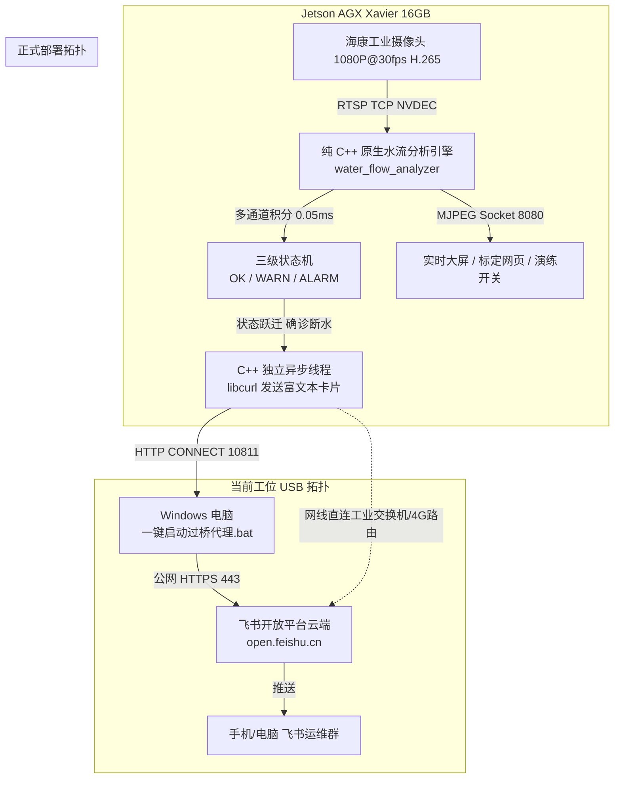

# 发电机冷却水智能视觉防护系统 - 深度交接文档 (2026-10-05 闭环验证版)

> **文档定位**：记录本轮对话中解决的全部底层核心技术难点，包括**全栈纯 C++ 原生飞书联动落地**、**Token 预取缓存与冷启动并发雪崩根治**、**单锚点追踪局限性与 1对1 演进路线**、**工位断网拓扑与透明过桥机制**，供后续开发者或接力对话 100% 无缝接续。

---

## 1. 核心架构与重要决策梳理



### 1.1 核心开发规范坚守
- **全栈纯 C++（0 Python 依赖）**：
  核心动能检测、NVDEC 硬件解码、MJPEG 广播服务器、标定通信与飞书卡片推送**全部由原生 C++ (`libcurl` + `pthread`) 驱动**，板端运行时不依赖任何 Python 脚本。
- **零阻塞视频管线设计**：
  飞书 HTTP 请求完全在 `std::thread().detach()` 独立线程中执行，网络波动对 1080P@30fps 主视频流产生 **0 微秒阻塞**。

---

## 2. 本轮解决的关键技术攻坚与避坑记录

### 2.1 飞书 Token 获取失败与超时（`Timeout was reached / 无效 Token`）彻底根治
- **故障排查**：
  板端开机时，画面在前 2 秒未完成帧差积分，5 根管道动能同时为 `0.0`，瞬间同时判定为断水 `RED`，同一毫秒并发触发 5 个线程抢互斥锁去请求 Token；此时若遇网络微小延迟，互斥锁阻塞引发串行超时（`Timeout was reached`），导致 Token 为空。
- **根本解决方案**：
  1. **Token 启动预取与常驻内存（Pre-fetch & Cache）**：
     在 `FeishuClient::init` 时，由后台独立单线程提前将飞书 Token（**有效期长达 2 小时 / 7200 秒**）预先获取并缓存在内存中。后续无论发生多少次断水报警，**直接使用内存中现成的 Token 秒发卡片**，彻底消灭临时发网请求抢 Token 的瓶颈。
  2. **冷启动 8 秒静音预热期**：
     系统启动前 8 秒内只做解码与动能平滑滤波，严禁触发报警，杜绝开机黑屏时 5 管并发误报。
  3. **单管道 60 秒冷却去抖（Cooldown）**：
     单管触发报警后，60 秒内不重复轰炸，供水恢复时立即发送绿底恢复卡片。

### 2.2 开发板物理断网与工位透明过桥机制
- **网络拓扑实情**：
  开发板网口（eth0）插在工业交换机直连海康摄像头（`192.168.1.64`），该局域网没有外网宽带；开发板通过 USB 虚拟网卡连接 Windows 电脑（`192.168.55.1` $\to$ `192.168.55.100`）。
- **过桥代理机制**：
  Windows 电脑提供轻量透明转发，开发板 `libcurl` 自动走 `192.168.55.100:10811` 上网发飞书。
- **交互规范升级**：
  **杜绝隐蔽后台（已删除 `.vbs`）**。在项目根目录下提供 **`一键启动电脑过桥代理(飞书上网用).bat`**，双击打开弹出明显的 CMD 黑窗口，测试录屏完毕**点右上角红叉 `X` 即可彻底退出**，100% 受用户可见控制。
  *(注：现场机柜部署时开发板插外网网线，该过桥代理自动功成身退，C++ 自动直连)*。

### 2.3 刚体锚点防抖（Anchor）的物理局限与演进路线
- **问题分析**：
  当前采用“1对多”全局单锚点刚体平移。由于工业相机存在微小旋转或广角透视畸变，远处单锚点到水管的杠杆臂距离高达数百像素，微小的角度晃动就会被成倍放大，导致“锚框局部对得准，远处的管口框反而被带偏”。
- **演进建议**：
  1. **方案 A（最推崇的工业级做法）**：固定机位摄像头已打螺栓固定，机位本身纹丝不动，**直接使用纯静态画框标定（0 锚点）**，杜绝光影水花反光干扰。
  2. **方案 B（1对1 局部自适应）**：每根管道专属绑定头顶 20 像素处的铁管金属管嘴，杠杆臂缩至极限，管管独立解耦。

### 2.4 Xshell X11 转发弹窗干扰消除
- 运行命令前加入 `unset DISPLAY`，彻底杜绝 NVDEC / EGL 触发 Xshell 弹出“需要 Xmanager 软件”的推销弹窗。

---

## 3. 核心文件资产分布与代码职责

```text
D:\Html\yolo-rtsp\ (板端映射路径: /data/workspace/)
├── 一键启动电脑过桥代理(飞书上网用).bat  # 【用户前台双击运行】Windows透明过桥代理(带显式窗口)
├── ssh_tools/
│   └── win_proxy.py                  # 轻量 HTTP/HTTPS CONNECT 转发服务
├── docs/                             # 项目设计与交接文档归档
│   ├── 冷却水监控开发进展与交接文档_20261005.md
│   └── 冷却水监控开发进展与交接文档_20261005_v2.md # 【本交接文档】
├── water/
│   ├── water_config.json             # 5 根管口标定 ROI、阈值、飞书参数配置文件
│   └── src/                          # 纯 C++ 核心源码
│       ├── feishu_client.h / .cpp    # 纯 C++ 原生异步飞书客户端 (支持 Token 预取与常驻)
│       └── test/                     # 测试与交互看板目录
│           ├── Makefile              # 纯 C++ 编译脚本 (链接 GStreamer, OpenCV Core, libcurl)
│           └── water_flow_analyzer.cpp # 【核心实时监控服务】内置 Web 推流、状态机与飞书联动
└── alarm_py/                         # 独立 Python 报警与继电器驱动 (备用/离线测试)
    ├── feishu_config.json            # 飞书 app_id / secret 配置
    └── feishu_alarm.py               # Python 版本客户端 (已验证通过)
```

---

## 4. 实操运行与录屏演示标准指南

### 步骤 1：在 Windows 启动过桥代理（若需要推飞书）
双击根目录：**`一键启动电脑过桥代理(飞书上网用).bat`**，保持小黑窗开启。

### 步骤 2：在板端前台启动监控程序
登录开发板（SSH）：
```bash
ssh root@192.168.55.1
cd /data/workspace/water/src/test
unset DISPLAY && ./water_flow_analyzer
```

**控制台将干净呈现以下看板**：
```text
[飞书联动] 纯 C++ 异步飞书告警客户端已成功装载！
[配置] 正在读取配置文件: ../../water_config.json
==========================================================
  发电机冷却水 5 根管道实时动能分析器 (自适应抗抖微调版)   
==========================================================
[输入源] 网络实时摄像头流 (RTSP): $RTSP_URL
✅ [FeishuClient-C++] 启动预取飞书 Token 成功，已常驻内存就绪！
Opening in BLOCKING MODE 
[Live] 硬件解码就绪，正在处理画面并提供 Web 实时推流...
========================================================
  >>> 冷却水视觉监控 (带自适应抗抖微调算法) 已就绪! <<<
  在 Windows 电脑浏览器中打开以下地址即可实时查看与标定：
  👉 实时大屏画面:  http://192.168.55.1:8080
  👉 在线鼠标标定:  http://192.168.55.1:8080/calibrate
  👉 模拟断水开关:  http://192.168.55.1:8080/cutoff
========================================================
```

### 步骤 3：在 Windows 浏览器联动演示
1. **看实时监控大屏**：浏览器访问 `http://192.168.55.1:8080`，查看 5 根水管出水画面、彩色状态框、动能读数与 FPS；
2. **模拟断水演练**：访问 `http://192.168.55.1:8080/cutoff`，2 秒内大屏 2 号水管变红，飞书群即刻收到 **🔴【紧急告警】发电机冷却水断流 - Pipe 2 异常** 异步卡片；
3. **恢复供水**：再次点击 `/cutoff`，大屏恢复绿色，飞书群即刻收到 **🟢【状态恢复】发电机冷却水正常** 卡片。

### 步骤 4：关闭与退出
- 板端终端直接按 **`Ctrl + C`** 安全退出；
- Windows 电脑直接点击代理黑窗口右上角 **`❌`** 关闭，0 后台残留。

---

## 5. 后续接续工作建议 (Next Steps)

1. **精细对齐 5 根水管坐标**：
   在标定页 `http://192.168.55.1:8080/calibrate`，鼠标拖拽准确对齐实际落水柱（尤其是 Pipe 5 与 Pipe 2），点击按钮保存。
2. **防抖模式定型**：
   根据现场机械震动情况，确定采用“纯静态 0 锚点”或升级为“1对1 管口自适应追踪”。
3. **8 路 Modbus 继电器模块到货联调**：
   中盛科技 `ZS-DIO-R-10A-8` 到货插上网线（IP: `192.168.1.200:502`）后，在 C++ 状态机中追加 Modbus-TCP 开关量闭合驱动，完成“视觉确诊 $\to$ 继电器动作 $\to$ 飞书推送”的完整工业闭环。
