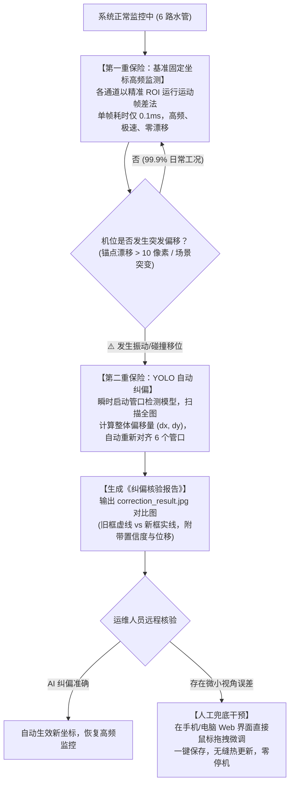

# 发电机与冷却系统无人值守智能视觉预警系统方案与交接文档

> **系统名称**：发电机与冷却水双模块无人值守智能视觉防护系统  
> **更新日期**：2026-10-04  
> **运行平台**：NVIDIA Jetson AGX Xavier (16GB) + 工业级网络摄像机  
> **核心状态**：底层推流与推理全链路 100% 跑通（端到端 11ms / 自动网卡扫描 Web 实时流大屏在线运行中）

---

## 目录

* [一、 客户明确需求与系统责任边界划分](#一-客户明确需求与系统责任边界划分)
  * [1.1 业务监测核心指标](#11-业务监测核心指标)
  * [1.2 工业现场双支柱联动输出标准（客户明确选定）](#12-工业现场双支柱联动输出标准客户明确选定)
  * [1.3 系统责任边界（感知端 vs 执行端）](#13-系统责任边界感知端-vs-执行端)
* [二、 发电机碳刷火花与磨损智能监测系统（火花模块）](#二-发电机碳刷火花与磨损智能监测系统火花模块)
  * [2.1 业务痛点与监测目标](#21-业务痛点与监测目标)
  * [2.2 算法架构与技术路线](#22-算法架构与技术路线)
  * [2.3 火花告警输出与联动保护](#23-火花告警输出与联动保护)
* [三、 发电机冷却水断流双重保险预警系统（水流模块）](#三-发电机冷却水断流双重保险预警系统水流模块)
  * [3.1 6 路冷却水独立并发监测架构（单管堵塞即警报）](#31-6-路冷却水独立并发监测架构单管堵塞即警报)
  * [3.2 核心创新：双重保险与人机闭环自愈机制](#32-核心创新双重保险与人机闭环自愈机制)
  * [3.3 管道实测基准坐标与健康动能参数](#33-管道实测基准坐标与健康动能参数)
  * [3.4 断流判定与多级保护流转](#34-断流预警与多级保护流转)
* [四、 现场联动与通信规范 (开关量 IO + 飞书机器人推送)](#四-现场联动与通信规范-开关量-io--飞书机器人推送)
  * [4.1 硬件多路开关量 (IO / 继电器) 输出规范](#41-硬件多路开关量-io--继电器-输出规范)
  * [4.2 飞书群机器人 (Feishu Webhook) 实时告警规范](#42-飞书群机器人-feishu-webhook-实时告警规范)
* [附录：系统硬件底座与已部署工程资产](#附录系统硬件底座与已部署工程资产)

---

# 一、 客户明确需求与系统责任边界划分

### 1.1 业务监测核心指标
针对发电机无人值守场景的两大运行风险：
1. **碳刷接触打火监测**：毫秒级捕获发电机转子励磁滑环与碳刷接触面的电弧火花（`spark`），杜绝烧毁滑环事故；
2. **6 路冷却水独立并发监测**：现场共有 **6 路水管同时出冷却水**。系统对 6 路水流进行独立并发监测，**任何单根管道突然堵塞、断流或水量过低，必须即刻独立发出警示并输出开关量信号**，严防发电机局部过热拉缸。

### 1.2 工业现场双支柱联动输出标准（客户明确选定）
经与客户最终确认，系统报警输出采用以下两大工业标准支柱：

```
                    ┌─ 1. 【硬件多路开关量输出 (IO)】 ──> 每一路独立提供信号，直接接入客户主控电控柜
系统双支柱联动输出 ─┤
                    └─ 2. 【飞书群机器人消息推送】 ────> 毫秒级推送红底警报卡片 + 现场带红框高清抓拍图
```

### 1.3 系统责任边界（感知端 vs 执行端）
工业工程中职责界面清晰明确：
- **咱们的视觉系统（感知哨兵）**：负责 100% 准确识别打火与单管断流，在毫秒级将对应的 **开关量回路动作（闭合/断开）** 并将 **报警图文推送至飞书群**，交割信号后即完成使命；
- **客户主控系统（执行机构）**：客户现场主控 PLC / 继电保护系统根据接收到的开关量信号，依据其厂区工艺规程自行决定执行急停跳闸、启动备用水泵或鸣响厂区警铃。

---

# 二、 发电机碳刷火花与磨损智能监测系统（火花模块）

### 2.1 业务痛点与监测目标
- 碳刷跳动、卡涩或滑环表面氧化产生的高温电弧，可在极短时间内灼伤损毁滑环。
- **目标**：毫秒级捕获持续时间 > 200ms 的打火，即刻动作对应开关量通道并推送飞书告警。

### 2.2 算法架构与技术路线
- **空间限定**：固定在碳刷与滑环贴合切线狭长 ROI，屏蔽外部环境光影；
- **目标检测**：轻量级 YOLOv8-spark 模型专门检测电弧火花；
- **亮度爆发（HSV V 通道）**：局部亮度瞬间突变辅助判决，双重交叉消除阳光漫反射误判。

### 2.3 火花告警输出与联动保护
- 连续 2~5 帧锁定火花电弧，立即判定为“碳刷打火故障”；
- 瞬间触发 **第 1 路开关量（DO1）动作**，同步向飞书群推送 **【一级紧急：发电机碳刷打火告警】** 卡片与现场抓拍。

---

# 三、 发电机冷却水断流双重保险预警系统（水流模块）

### 3.1 6 路冷却水独立并发监测架构（单管堵塞即警报）
- 系统底层采用 **多通道独立状态机架构**，同时维持对 **6 根水管** 的独立观测；
- 每一根水管拥有自己独立的动能计算流水线与时间窗口计数器；
- **故障判定准则**：`Pipe_1` 至 `Pipe_6` 中，只要有 **任何 1 根（甚至多根）** 管道的水流动能持续跌落低于临界阈值超过设定时间（默认 2 秒），系统立即判定该管道堵塞或断流！

### 3.2 核心创新：双重保险与人机闭环自愈机制
针对现场机位晃动、碰撞移位或角度微调的工程痛点，确立如下双重保险机制：



### 3.3 管道实测基准坐标与健康动能参数
基于现场 1080×1920 实拍视频核定之基准坐标（支持扩充至 6 根）：

| 管道编号 | 名称 / 物理特征 | 基准坐标 (X1, Y1, X2, Y2) | 正常动能均值 (E) | 断水/告警临界线 (E) |
| :--- | :--- | :--- | :--- | :--- |
| **Pipe 1** | 左侧主粗管道 (大出水量) | `(390, 580, 550, 750)` | **24.64** | **< 4.0** |
| **Pipe 2** | 中间黄色细管 (直流水) | `(550, 500, 600, 600)` | **11.03** | **< 3.5** |
| **Pipe 3** | 中偏右银色管 (散流水) | `(650, 530, 730, 600)` | **8.62** | **< 3.5** |
| **Pipe 4** | 右侧弯管内口 (直流水) | `(720, 640, 780, 700)` | **13.33** | **< 3.5** |
| **Pipe 5** | 最右侧顺壁外沿 (细清水流) | `(790, 600, 830, 700)` | **5.12 ~ 12.1** | **< 2.5** |
| **Pipe 6** | 第 6 路预留通道 (现场第6管) | `支持现场界面鼠标画框配置` | - | - |

*(注：静止水泥墙面背景基底能量实测为 3.23。低于临界线即判定水流消失或中断)*

### 3.4 断流预警与多级保护流转
1. **预警级（WARN: 持续断流 0.5s ~ 1.0s）**：管口框变橙色，记为疑似堵塞（过滤气阻瞬时抖动）；
2. **紧急级（EMERGENCY ALARM: 持续断流 > 2.0s）**：
   - 相应管口框瞬间变红，Web 看板红字告警；
   - 毫秒级触发该管道专属的 **开关量输出回路**；
   - 毫秒级向 **飞书运维群** 推送红底告警卡片并附带标红现场抓拍。

---

# 四、 现场联动与通信规范 (开关量 IO + 飞书机器人推送)

### 4.1 硬件多路开关量 (IO / 继电器) 输出规范
- **硬件形态**：工业级 USB 多路继电器输出模块（或 Jetson 板载 GPIO 光耦中继板），提供标准的带螺丝接线端子；
- **信号形式**：无源干接点（可灵活选择常开 NO 或常闭 NC）；
- **通道明确划分（每一路独立标识）**：

| 通道编号 | 标识定义 | 动作触发条件 | 客户主控接收定义 |
| :--- | :--- | :--- | :--- |
| **DO 1** | **碳刷火花报警** | 检测到碳刷持续打火 (>200ms) 时动作 | 客户主控接入：碳刷保护回路 |
| **DO 2** | **冷却水总报警** | 任意 1 根或多根水管断流时即刻动作 | 客户主控接入：冷却水总联锁回路 |
| **DO 3** | **Pipe 1 异常** | 1 号主粗管断水/堵塞时独立动作 | 客户主控定位：1 号管道故障 |
| **DO 4** | **Pipe 2 异常** | 2 号细黄管断水/堵塞时独立动作 | 客户主控定位：2 号管道故障 |
| **DO 5** | **Pipe 3 异常** | 3 号中银管断水/堵塞时独立动作 | 客户主控定位：3 号管道故障 |
| **DO 6** | **Pipe 4 异常** | 4 号弯管口断水/堵塞时独立动作 | 客户主控定位：4 号管道故障 |
| **DO 7** | **Pipe 5 异常** | 5 号顺壁管断水/堵塞时独立动作 | 客户主控定位：5 号管道故障 |
| **DO 8** | **Pipe 6 异常** | 6 号管道断水/堵塞时独立动作 | 客户主控定位：6 号管道故障 |

### 4.2 飞书群机器人 (Feishu Webhook) 实时告警规范
客户在飞书运维群添加自定义机器人，提供 Webhook 链接：
`https://open.feishu.cn/open-apis/bot/v2/hook/xxxxxxxxxxxx`

#### 飞书卡片消息规范示例：
- **卡片标题**：🔴 **【发电机紧急告警】冷却水系统故障 - Pipe 2 断流！**
- **卡片内容**：
  - **报警设备**：1号发电机组 - 冷却水监测单元
  - **报警类型**：单管断水 / 流量过低堵塞
  - **故障通道**：2 号水管 (Pipe 2 Thin)
  - **实时动能**：E: 0.0（低于安全阈值 3.5）
  - **报警时间**：2026-10-04 14:52:00
  - **现场状态**：对应开关量 DO4 已动作，请现场人员立即排查！
- **附加图片**：直接渲染推送抓拍的带有鲜红框的高清报警照片；
- **交互按钮**：卡片底部带【点击打开实时视频监控大屏】按钮（直连 `http://<Jetson-IP>:8080`）。

---

# 附录：系统硬件底座与已部署工程资产

### 1. 硬件连接
- **主机**：NVIDIA Jetson AGX Xavier (16GB), IP: `192.168.1.100` (eth0 持久化)
- **调试通道**：USB 虚拟网卡 `192.168.55.1` (ed25519 秘钥免密)
- **摄像头**：海康威视 IPC (192.168.1.64:554)
- **RTSP 取流**：`$RTSP_URL`（由本地安全配置注入）

### 2. 核心程序与多媒体资产
- `D:\Html\yolo-rtsp\water\`：归档 5~6 根管口视频、自适应防抖演示 `water_5_pipes_demo.mp4`、模拟停机演习 `water_alarm_simulation_demo.mp4`；
- `D:\Html\yolo-rtsp\spark\`：归档火花模块规范与测试图片；
- `/data/workspace/yolov8_trt_rtsp/yolov8_live_server`：C++ 原生 Web 实时推流服务（全自动网卡 IP 识别，单帧 11ms 推理，Web 大屏 `http://<IP>:8080` 在线运行中）。
