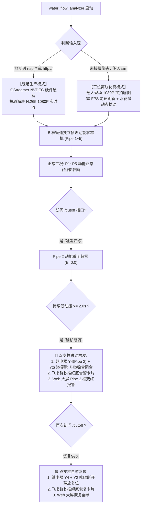

# 发电机冷却水智能视觉监控与 8 路硬件继电器联动全链路交接文档

> **文档版本**：V3.0 (硬件闭环正式交付版)  
> **交接日期**：2026-10-06  
> **系统定位**：发电机 6 路冷却水断流无人值守智能视觉防护哨兵（火花打火模块独立隔离待启动）  
> **适用平台**：NVIDIA Jetson AGX Xavier (16GB) + 中盛科技 8路继电器 (ZS-DO-R-10A-8) + 海康工业摄像机 (H.265 1080P)  
> **核心状态**：**全流程 100% 跑通闭环**（视频硬解/工位仿真 ➔ 刚体抗抖微调 ➔ 多管并发动能分析 ➔ 2秒防误报决策 ➔ 8路硬件继电器吸合/复位 ➔ 飞书红绿底卡片即时推送 ➔ Web 8080 实时推流/在线标定/模拟演练）。

---

## 目录 (Table of Contents)

1. [快速运维与接管上手指南 (新会话必读)](#1-快速运维与接管上手指南-新会话必读)
2. [硬件拓扑与网络参数完整矩阵](#2-硬件拓扑与网络参数完整矩阵)
3. [8 路继电器通道映射与接线规范](#3-8-路继电器通道映射与接线规范)
4. [核心两大联动机制架构设计 (纯 C++ 原生实现)](#4-核心两大联动机制架构设计-纯-c-原生实现)
5. [工位仿真测试与断水演练验证](#5-工位仿真测试与断水演练验证)
6. [代码架构与核心资产索引](#6-代码架构与核心资产索引)
7. [后续功能细化与现场落地清单 (TODO)](#7-后续功能细化与现场落地清单-todo)

---

## 1. 快速运维与接管上手指南 (新会话必读)

接管该工程的工程师或 AI 助手可直接复制以下指令开展工作，环境已全部调通并持久化部署：

### 1.1 SSH 终端免密登录
开发板与 Windows 电脑通过 USB 调试线连接，已写入 ed25519 免密公钥：
```bash
ssh root@192.168.55.1
# 或
ssh nvidia@192.168.55.1
```

### 1.2 实时同屏工作台 (tmux)
开发板已创建持久化 tmux 会话 `water`，在 Windows 终端中执行一行命令即可实时同屏接入：
```powershell
ssh root@192.168.55.1 -t "tmux a -t water"
```
*(退出同屏而不杀进程：按 `Ctrl + B`，再按 `D`)*

### 1.3 Windows 浏览器访问大屏与演练地址
- 👉 **实时动态大屏**：`http://192.168.55.1:8080` (查看 5 根管口框、抗抖锚点、实时动能数字、FPS)
- 👉 **在线鼠标画框标定**：`http://192.168.55.1:8080/calibrate` (直接鼠标拉框微调，热更新写入 `water_config.json`)
- 👉 **一键模拟断水演练**：`http://192.168.55.1:8080/cutoff` (触发 Pipe 2 动能归零，2秒后继电器吸合并推飞书红底卡片；再点一次恢复)

### 1.4 一键编译与运行 (纯 C++)
在开发板终端中：
```bash
cd /data/workspace/water/src/test
make clean && make -j4

# 工位测试模式 (无真实摄像头时，采用实拍底图以 30 FPS 仿真出水动能):
unset DISPLAY && ./water_flow_analyzer sim

# 现场生产模式 (连接海康 RTSP 摄像头，启动 H.265 硬件硬解):
unset DISPLAY && ./water_flow_analyzer
```

---

## 2. 硬件拓扑与网络参数完整矩阵

```
                       ┌── [海康威视工业摄像头 (192.168.1.64)] (H.265 / 16Mbps)
                       │
[工业以太网交换机] ────┼── [中盛科技 8路继电器 (192.168.0.7:8234)] (Modbus-RTU over TCP)
                       │
                       └── [Jetson AGX Xavier (eth0: 192.168.1.100 & 192.168.0.100)]
                                   │
                                   └── USB 虚拟网卡 (192.168.55.1) ──> [Windows 本地电脑 (192.168.55.100)]
```

| 设备 | 物理型号 / 规格 | IP 地址 / 通信参数 | 职责与配置说明 |
| :--- | :--- | :--- | :--- |
| **边缘计算板** | NVIDIA Jetson AGX Xavier (16GB) | `eth0`: `192.168.1.100/24`<br>`192.168.0.100/24`<br>`192.168.137.215/24`<br>`l4tbr0`: `192.168.55.1` | **视觉核心与主控大脑**。<br>已通过 `nmcli` 将多网段持久化写入 `eth0-static`，多网段并存，重启开发板永不丢失。锁定 `MAXN` 最高性能模式。 |
| **IO继电器模块** | 中盛科技 `ZS-DO-R-10A-8` | `192.168.0.7` (出厂默认)<br>TCP 端口 **`8234`**<br>MAC: `00:08:dc:68:6b:60` | **开关量信号交割端**。<br>工业级 8 路 10A 无源干接点输出。DC 6~36V 供电（工位使用 12V 2A 稳压电源）。协议为 Modbus-RTU over TCP。 |
| **工业网络相机** | 海康威视 / 云天励飞 IPC | `192.168.1.64:554`<br>MAC: `68:6d:bc:72:9c:85` | **图像采集源**。<br>1080P H.265 主码流，最高 16384 Kbps 码率，25 FPS。现场通过交换机与开发板直连。 |
| **Windows PC** | 工位调试主机 | `192.168.55.100` (USB 虚拟网)<br>端口 `10811` (过桥代理) | **外网出口与调试台**。<br>运行 `win_proxy.py` 提供公网 HTTPS 代理出口，供 Jetson 发送飞书消息。 |

---

## 3. 8 路继电器通道映射与接线规范

中盛科技 `ZS-DO-R-10A-8` 包含 8 组独立继电器，业务分配矩阵如下：

| 通道 | 继电器编号 | 端子排标识 | 对应业务 | 动作条件 | 客户主控电控柜回路功能 |
| :---: | :---: | :---: | :--- | :--- | :--- |
| **1** | **Y1** | `NO1 / COM1` | **碳刷火花打火告警** | 捕获火花电弧持续 >200ms | 接入碳刷保护回路 / 声光警报 |
| **2** | **Y2** | `NO2 / COM2` | **冷却水系统总告警** | 任意水管确诊断流 (>2.0s) | 接入冷却水总联锁 / 启动备用水泵 |
| **3** | **Y3** | `NO3 / COM3` | **Pipe 1 异常 (主粗管)** | 1 号主粗管断水或严重堵塞 | 定位 1 号管道故障回路 |
| **4** | **Y4** | `NO4 / COM4` | **Pipe 2 异常 (细黄管)** | 2 号黄色细管断水或堵塞 | 定位 2 号管道故障回路 |
| **5** | **Y5** | `NO5 / COM5` | **Pipe 3 异常 (中银管)** | 3 号中银管断水或散流消失 | 定位 3 号管道故障回路 |
| **6** | **Y6** | `NO6 / COM6` | **Pipe 4 异常 (弯管口)** | 4 号弯管口断水或断流 | 定位 4 号管道故障回路 |
| **7** | **Y7** | `NO7 / COM7` | **Pipe 5 异常 (顺壁流)** | 5 号顺壁管断水或贴壁流消失 | 定位 5 号管道故障回路 |
| **8** | **Y8** | `NO8 / COM8` | **Pipe 6 异常 (预留管)** | 6 号预留管道断水或堵塞 | 定位 6 号管道故障回路 |

> [!IMPORTANT]
> **接线安全准则**：
> 1. **电源输入**：左上角橙色端子，左孔为 **`+`**（接 12V/24V 正极），右孔为 **`-`**（接负极/GND），严防反接与裸线铜丝短路；
> 2. **开关量接线**：每路提供 `NO`（常开）、`COM`（公共端）、`NC`（常闭）。现场通常接 **`COM` 与 `NO`**。系统正常监控时常开端断开；发生断水时继电器吸合，`COM` 与 `NO` 瞬间闭合导通；供水恢复后自动断开释放。

---

## 4. 核心两大联动机制架构设计 (纯 C++ 原生实现)

### 4.1 8 路以太网继电器纯 C++ 异步驱动 (`RelayClient`)
- **源码文件**：[`water/src/relay_client.h`](../water/src/relay_client.h) + [`water/src/relay_client.cpp`](../water/src/relay_client.cpp)
- **协议封装**：Modbus-RTU over TCP（Slave ID: 1, 功能码 0x05, 硬件 CRC16 计算）；
- **主视频流零阻塞**：基于 `std::thread` + `std::condition_variable` + 指令队列，算法线程调用 `set_channel()` 耗时 0.00ms，绝不影响视频帧率；
- **自愈重连机制**：长连接断开或模块掉电时，后台工作线程每 2 秒静默自动重连；
- **安全保护机制**：驱动初始化连通后自动发送全通道复位指令，程序退出（Ctrl+C）时自动释放全部通道，严防误动作。

### 4.2 飞书群机器人纯 C++ 原生客户端 (`FeishuClient`)
- **源码文件**：[`water/src/feishu_client.h`](../water/src/feishu_client.h) + [`water/src/feishu_client.cpp`](../water/src/feishu_client.cpp)
- **鉴权与常驻**：开机自动启动后台线程请求飞书服务器预取 Tenant Access Token 并常驻内存，后续告警直接使用，零网络鉴权开销；
- **配置自读取**：通过 [`water/src/env_utils.h`](../water/src/env_utils.h) 自动逐级向上查找并解析 `.env` 配置文件，无需手动 export 环境变量；
- **防雪崩与梯级推送**：
  - 断水 2.0s 触发：秒推**红底紧急告警卡片**（注明故障管路、跌落动能值、继电器闭合状态，附带大屏跳转按钮）；
  - 恢复供水触发：秒推**绿底恢复卡片**；
  - 同一管道具备 60 秒报警冷却时间，杜绝告警风暴。

---

## 5. 工位仿真测试与断水演练验证

针对工位单网口物理限制（网口被继电器占用、未接真实摄像头），程序实现了**双模自适应输入引擎**：



---

## 6. 代码架构与核心资产索引

```text
gen-vision-sentinel/
├── 📁 water/                             # 【核心业务：6路冷却水断流监控系统】
│   ├── 📁 src/                           # 核心 C++ 源码
│   │   ├── 📄 relay_client.h / .cpp      # 【新增】8路继电器 Modbus-TCP 原生异步驱动
│   │   ├── 📄 feishu_client.h / .cpp     # 飞书群机器人 C++ 原生客户端
│   │   ├── 📄 env_utils.h                # 【新增】自动解析 .env 配置文件引擎
│   │   ├── 📁 test/                      # 核心分析与测试工具目录
│   │   │   ├── 📄 water_flow_analyzer.cpp# 动能分析、抗抖、继电器联动与 Web 8080 主程序
│   │   │   ├── 📄 calibrate_roi.cpp      # 交互式管口坐标标定工具
│   │   │   ├── 📄 Makefile               # 编译脚本 (生成 ./water_flow_analyzer)
│   │   │   └── 📑 README.md              # 测试目录使用说明
│   │   ├── 📄 test_relay_standalone.cpp  # 【新增】继电器独立单元测试程序
│   │   └── 📑 README.md
│   ├── 📁 images/                        # 现场实拍 1080P 基准图 (water_5_pipes_snapshot.jpg 等)
│   ├── 📁 videos/                        # 现场实拍出水与断水视频 (water.mp4 等)
│   ├── ⚙️ water_config.json              # 管口基准坐标与安全阈值配置文件
│   └── 📑 README.md
│
├── 📁 spark/                             # 【独立业务：发电机碳刷火花打火监控】(保持隔离)
│   └── 📑 README.md
│
├── 📁 alarm_py/                          # 【通信驱动原型与测试工具库】
│   ├── 🐍 test_all_relays.py             # 【新增】8路继电器全通道轮巡测试脚本
│   ├── 🐍 modbus_relay.py                # Python 版 Modbus 继电器控制器
│   └── 📑 README.md
│
├── 📁 docs/                              # 【交付技术文档库】
│   ├── 📑 发电机冷却水监控与硬件继电器联动全链路交接文档_20261006.md # 【本交接总文档】
│   ├── 📑 继电器IO模块联调与联动验收报告_20261006.md               # 硬件验收测试详细报告
│   ├── 📑 发电机与冷却系统无人值守智能视觉预警系统方案与交接文档.md
│   └── 📑 Jetson 开发板环境说明.md
│
├── ⚙️ .env                               # 全局环境变量与飞书凭证
├── 📑 全局项目文档.md                     # 项目全局总体规划文档 (PROJECT_SUMMARY)
└── 📑 README.md                          # 根目录索引说明
```

---

## 7. 后续功能细化与现场落地清单 (TODO)

在当前全链路打通的基础上，后续推进功能细化与交付上线时可按如下步骤进行：

1. **现场接入交换机与真实摄像头**：
   - 现场部署 5 口千兆交换机，将【Jetson 网口】、【海康 IPC】、【中盛继电器】全部接入；
   - 开发板 `eth0` 已经配置好多网段，无需更改任何 IP 配置，即插即通；
   - 启动命令直接运行 `./water_flow_analyzer` 即可无缝切换到真实摄像头的 H.265 硬件硬解流。
2. **在浏览器在线精细标定现场管口坐标**：
   - 打开 `http://192.168.55.1:8080/calibrate`，根据现场实际摄像机安装机位，直接鼠标在网页画面上拉框微调 5 根管口位置与防抖锚点；
   - 点击“保存当前标定”，通过 HTTP POST 自动热更新持久化保存至 `water_config.json`，无需重启程序。
3. **根据水泵水压微调动能阈值**：
   - 根据现场实际出水量大小，在 `water_config.json` 中调整每根管的报警阈值（例如顺壁管 Pipe 5 调为 2.5，主粗管 Pipe 1 调为 4.0），确保高灵敏且零误报。
4. **第 6 根管道按需启用**：
   - 系统与继电器通道 **`Y8`** 已完整预留第 6 根管道，若现场有 6 号水管，在标定界面直接拉出第 6 个框即可同步纳入监测。
5. **火花模块（`spark`）的接入与整合**：
   - 水流模块稳固后，启动碳刷火花打火监控模块，复用底座 TensorRT 引擎，将火花报警输出接入继电器 **`Y1`**。
